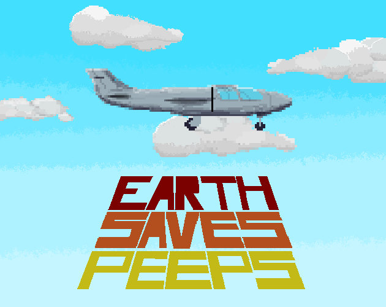

# Uh… What?

An airplane with failed engines. A crew without hope. But Earth (aka, you) sees the gravity of the situation and saves the day!

Control the gravitational forces acting on the plane and guide it to a safe landing location.

## Play

[Play it here!](https://chrisdanger.itch.io/earth-saves-peeps)

## Controls

* Increase gravity: Down arrow or R2 on the gamepad.
* Decrease gravity: Up arrow or L2 on the gamepad.

## But... why?

This is our glorious submission for [Untitled Game Jam #18](https://itch.io/jam/untitled-game-jam-18).

## Credits

### Graphics

* The font _FutilePro_ is part of the [_Humble Fonts Free_](https://somepx.itch.io/humble-fonts-free) font pack by [Eeve Somepx](https://somepx.itch.io).
* Godot Logo (C) Andrea Calabró. Distributed under the terms of the [Creative Commons Attribution License version 3.0 (CC-BY 3.0)](https://creativecommons.org/licenses/by/3.0/legalcode).
